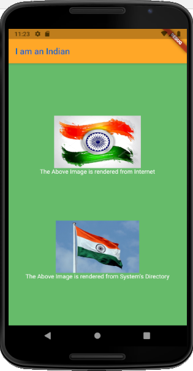

# i_am_indian

My first ever flutter project, made just for learning purpose.

- I have made this project with the help of Udemy Course on Flutter Development taught by Angela Yu of appbrewery.com
- This project is first of the 12 projects we will be making from this course.
- The snapshot of the app looks like this:
  
